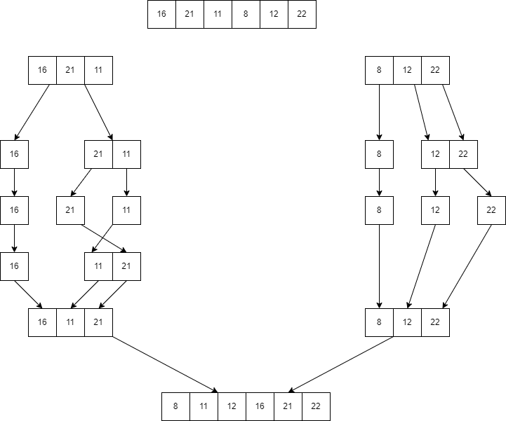

# Proje 2 Merge Sort

- [16,21,11,8,12,22] -> Merge Sort
- Yukarıdaki dizinin sort türüne göre aşamalarını yazınız.
- Big-O gösterimini yazınız.

- Worst Case Time Complexity: O(n\*log n)

- Best Case Time Complexity: O(n\*log n)

- Average Time Complexity: O(n\*log n)

- Merge sort'un her üç durumda da time complexity'si aynıdır. Çünkü merge sort,
  her durumda array'i ikiye böler ve tekrar birleştirmesi lineer zaman alır.
